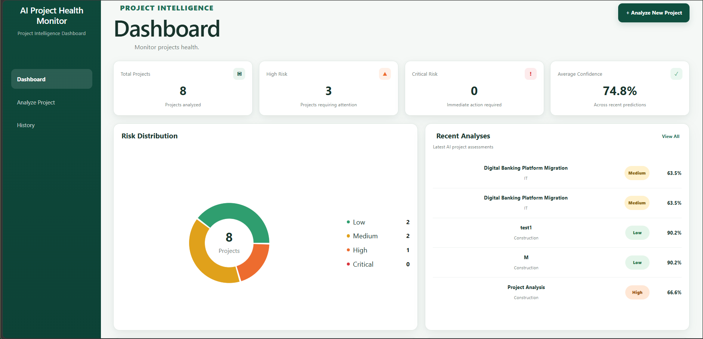
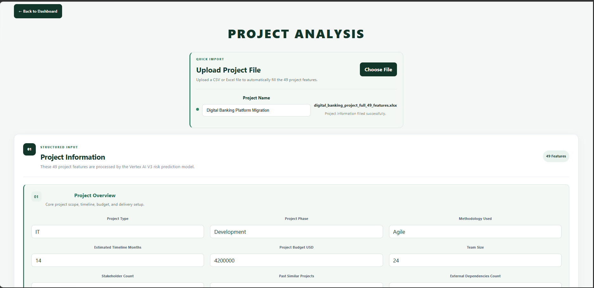
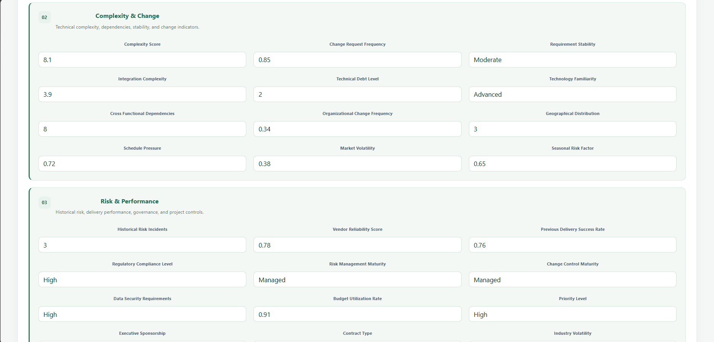
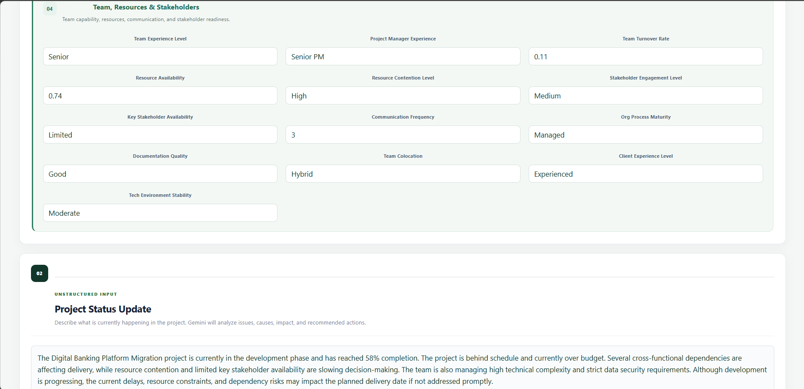
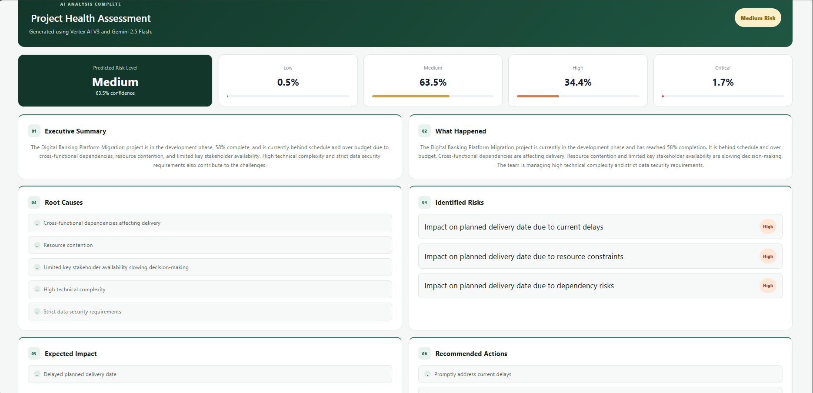
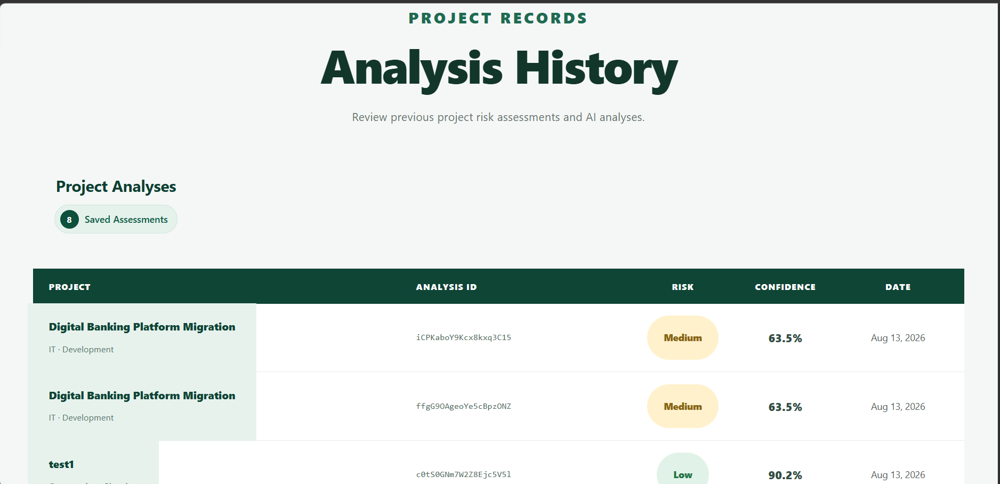
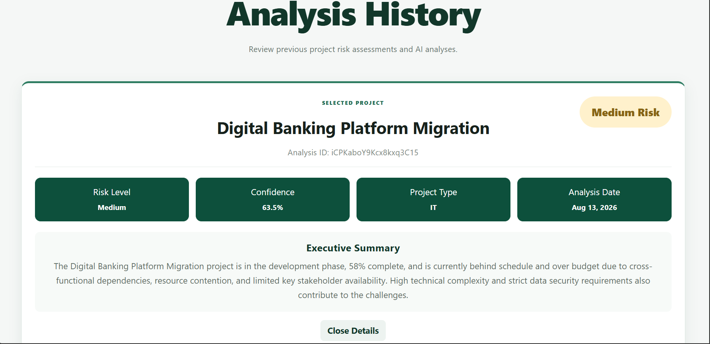

# AI Project Health Monitor

> An end-to-end cloud-native AI platform for predicting project risk, analyzing project health, and generating actionable management insights using Deep Learning, Generative AI, and Google Cloud Platform.

---

## Overview

**AI Project Health Monitor** is an intelligent project risk assessment platform designed to help organizations identify potential project risks before they significantly affect delivery.

Modern projects are influenced by many interconnected factors such as budget utilization, schedule pressure, team experience, technical complexity, stakeholder engagement, resource availability, vendor reliability, organizational maturity, and external dependencies.

Evaluating all of these factors manually can be difficult and inconsistent.

AI Project Health Monitor addresses this problem by combining:

- A **custom-trained Deep Learning model** for project risk prediction.
- **49 structured project features** covering technical, financial, organizational, and management factors.
- **Gemini 2.5 Flash** for contextual analysis of natural-language project status updates.
- **Vertex AI** for cloud-based model serving.
- **Cloud Firestore** for persistent analysis history.
- **FastAPI** for backend orchestration and REST APIs.
- **React** for the user interface.
- **Docker** for application containerization.
- **Artifact Registry** for container image management.
- **Google Cloud Run** for production deployment.

The result is a hybrid AI system capable of producing both **predictive risk intelligence** and **human-readable project insights**.

---

# Problem Statement

Project health cannot be accurately evaluated using only one metric.

A project may appear healthy based on its completion percentage while simultaneously experiencing problems such as:

- Budget overruns
- Schedule delays
- Resource shortages
- Vendor issues
- High technical complexity
- Unstable requirements
- Cross-functional dependencies
- Limited stakeholder availability
- Technical debt
- Weak change management
- Security constraints

Traditional project reporting often requires managers to manually interpret these signals.

This creates three major challenges:

1. Risk may be discovered too late.
2. Project assessments may vary depending on the evaluator.
3. Large amounts of project information can be difficult to interpret quickly.

AI Project Health Monitor was developed to automate and improve this process.

---

# Solution

The platform combines **Deep Learning** and **Generative AI**.

The Deep Learning model analyzes structured project information and predicts the project's overall risk level.

Gemini analyzes the project's natural-language status update to understand the current situation and generate management-friendly insights.

The platform therefore transforms:

```text
Structured Project Data
        +
Project Status Update
        ↓
AI Project Health Analysis
        ↓
Risk Level
Confidence Score
Executive Summary
Project Insights
Historical Assessment
```

---

# Key Features

- Custom-trained Deep Learning risk prediction model
- 49-feature project risk assessment
- Risk classification
- Prediction confidence scoring
- CSV project data import
- Excel project data import
- Manual structured project input
- Natural-language project status analysis
- Gemini-powered project intelligence
- AI-generated executive summaries
- Persistent analysis history
- Detailed project assessment view
- Project portfolio dashboard
- Recent project analysis monitoring
- AI Engine Status interface
- REST API architecture
- Dockerized frontend and backend
- Vertex AI model deployment
- Cloud Firestore integration
- Artifact Registry image management
- Google Cloud Run production deployment
- Interactive project risk distribution visualization
- Portfolio-level risk dashboard

---

# Application Screenshots

## Dashboard

The main dashboard provides a centralized overview of analyzed projects, including total projects, high-risk projects, critical-risk projects, recent AI analyses, and the operational status of the AI services.



---

## Project Analysis

The Project Analysis interface allows users to provide the 49 structured project features required by the Deep Learning risk prediction model.

Users can either enter the project information manually or upload an Excel/CSV file using the Quick Import feature.



The structured project features are organized into logical categories such as project characteristics, complexity, change, risk, performance, resources, and stakeholders.



---

## Structured and Unstructured Project Intelligence

In addition to the structured project features, users can provide a natural-language Project Status Update.

This unstructured information is analyzed using Gemini 2.5 Flash to identify project issues, causes, impacts, and recommended actions.



---

## AI Project Health Assessment

After submitting the project, the platform combines the Deep Learning risk prediction with Gemini-powered contextual analysis.

The assessment displays the predicted risk level and the probability distribution across the available risk classes.

It also generates:

- Executive Summary
- What Happened
- Root Causes
- Identified Risks
- Expected Impact
- Recommended Actions



---

## Analysis History

Every completed assessment is stored in Cloud Firestore.

The Analysis History interface allows users to review previous project assessments, including their risk classification, confidence score, analysis ID, and analysis date.



---

## Saved Project Details

Selecting a previous assessment displays the project's stored analysis details, including:

- Risk Level
- Confidence Score
- Project Type
- Analysis Date
- Executive Summary


---

# AI Architecture

AI Project Health Monitor uses a **Hybrid AI Architecture**.

Two different AI approaches are responsible for different parts of the analysis.

```text
                    PROJECT INPUT
                         │
          ┌──────────────┴──────────────┐
          │                             │
          ▼                             ▼
  Structured Project Data      Project Status Update
       49 Features                 Natural Language
          │                             │
          ▼                             ▼
   Data Preprocessing            Gemini 2.5 Flash
          │                             │
          ▼                             ▼
 Deep Learning Model            Context Analysis
          │                             │
          ▼                             │
 Risk + Confidence                     │
          │                             │
          └──────────────┬──────────────┘
                         ▼
               PROJECT INTELLIGENCE
                         │
              ┌──────────┼──────────┐
              ▼          ▼          ▼
          Risk Level  Confidence  Executive
                                  Summary
```

This hybrid approach provides both:

**Predictive AI**

> What is the project's predicted risk?

and:

**Generative AI**

> What is happening in the project, why does it matter, and what should decision-makers understand?

---

# Deep Learning Risk Prediction Model

The predictive component of the system is a **custom-trained Deep Neural Network (DNN)**.

The model was developed to classify project risk using structured project characteristics.

Instead of relying on a single project indicator, the model receives **49 project features**.

The general inference pipeline is:

```text
Project Data
     ↓
49 Project Features
     ↓
Data Validation
     ↓
Preprocessing Pipeline
     ↓
Deep Neural Network
     ↓
Risk Probabilities
     ↓
Risk Classification
     ↓
Confidence Score
```

---

# Project Features

The Deep Learning model evaluates 49 project-related variables.

These features represent multiple dimensions of project health.

### Project Characteristics

- Project Type
- Team Size
- Project Budget
- Estimated Timeline
- Complexity Score
- Project Phase
- Priority Level
- Project Start Month
- Current Phase Duration
- Seasonal Risk Factor

### Team & Management

- Team Experience Level
- Team Turnover Rate
- Project Manager Experience
- Team Colocation
- Communication Frequency
- Resource Availability
- Resource Contention Level

### Stakeholders

- Stakeholder Count
- Stakeholder Engagement Level
- Key Stakeholder Availability
- Executive Sponsorship
- Client Experience Level

### Delivery & Planning

- Methodology Used
- Past Similar Projects
- Requirement Stability
- Schedule Pressure
- Budget Utilization Rate
- Previous Delivery Success Rate
- Documentation Quality

### Dependencies & Integration

- External Dependencies Count
- Cross-Functional Dependencies
- Integration Complexity
- Vendor Reliability Score
- Contract Type

### Technology & Security

- Technology Familiarity
- Technical Debt Level
- Tech Environment Stability
- Data Security Requirements

### Organization & Governance

- Organizational Change Frequency
- Organizational Process Maturity
- Change Control Maturity
- Risk Management Maturity
- Regulatory Compliance Level

### Business & Environment

- Funding Source
- Market Volatility
- Industry Volatility
- Geographical Distribution
- Historical Risk Incidents
- Change Request Frequency

---

# Data Preprocessing

Production data must be transformed in exactly the same way as the data used during model development.

For this reason, the project includes a dedicated preprocessing pipeline.

The preprocessing layer handles operations such as:

- Input validation
- Feature ordering
- Numerical variables
- Categorical variables
- Missing values
- Feature transformation
- Model-compatible formatting

The preprocessing artifact is stored separately from the trained Deep Learning model.

This allows the production backend to reproduce the same transformations used during model development.

```text
Raw Project Data
       ↓
Preprocessor
       ↓
Model-Compatible Features
       ↓
Deep Learning Model
```

---

# Risk Prediction

After preprocessing, the transformed project features are passed to the Deep Learning model.

The prediction result is converted into a project risk classification.

The platform supports four project risk categories:

- **Low Risk**
- **Medium Risk**
- **High Risk**
- **Critical Risk**

In addition to the final classification, the model returns a probability
distribution across all four risk classes. The highest probability determines
the predicted risk level, while its probability is presented as the model's
confidence score.

Example:

Low: 0.5%
Medium: 63.5%
High: 34.4%
Critical: 1.7%

Predicted Risk Level: Medium
Confidence: 63.5%

---

This information is then combined with the contextual AI analysis before the final project assessment is presented.

---

# Generative AI Project Analysis

Structured data can describe the measurable characteristics of a project, but project teams frequently communicate important information through natural language.

For example:

```text
The project is behind schedule because an external vendor
has not delivered the required API endpoints.

The backend team is blocked and integration testing
has been postponed.
```

To analyze this type of information, the platform integrates **Gemini 2.5 Flash**.

Gemini receives the project status update and produces contextual project intelligence.

The analysis can consider:

- Current issues
- Causes
- Project impact
- Delivery concerns
- Risk indicators
- Management implications
- Recommended actions

---

# Executive Summary

One of the main outputs of the Generative AI layer is an executive summary.

Instead of requiring managers to inspect dozens of individual project variables, the platform produces a concise explanation of the project's current condition.

Example:

```text
The project is currently behind schedule due to external
dependency delays that are blocking backend development and
postponing integration testing. If the dependency is not
resolved promptly, the planned production launch may be affected.
```

The executive summary is designed to make AI analysis useful for both technical and management stakeholders.

Potential users include:

- Project Managers
- PMO Teams
- Program Managers
- Delivery Managers
- Risk Management Teams
- Technology Managers
- Executives

---

# Project File Import

Entering 49 features manually can be time-consuming.

The application therefore provides a **Quick Import** feature.

Users can upload:

- `.csv`
- `.xlsx`

project files.

The workflow is:

```text
CSV / Excel
     ↓
File Upload
     ↓
FastAPI
     ↓
Pandas / OpenPyXL
     ↓
Project Data Extraction
     ↓
49 Features
     ↓
Frontend Form
     ↓
Project Analysis
```

This allows existing project information to be quickly imported into the platform.

---

# Structured Input

Users can also manually enter project information through the application.

The structured form contains the features required by the Deep Learning prediction model.

This makes the system usable even when the project information is not available in a pre-existing spreadsheet.

---

# Unstructured Input

The **Project Status Update** section accepts natural-language information.

This represents the second major data source used by the platform.

Therefore, one project assessment can combine:

```text
STRUCTURED INPUT
49 Project Features
        +
UNSTRUCTURED INPUT
Project Status Update
        ↓
Hybrid AI Analysis
```

---

# Backend Architecture

The backend was developed using **FastAPI**.

It acts as the orchestration layer between the application and the AI/cloud services.

Backend responsibilities include:

- REST API management
- Project data validation
- File upload processing
- Excel extraction
- CSV extraction
- Feature validation
- Data preprocessing
- Deep Learning inference integration
- Vertex AI communication
- Gemini integration
- Firestore integration
- Analysis creation
- Analysis history retrieval
- Health monitoring

The backend exposes API documentation through FastAPI's Swagger interface.

---

# Backend Health Check

The application provides a health endpoint for verifying that the deployed backend is available.

Example:

```json
{
  "status": "healthy"
}
```

This endpoint can be used to quickly verify the Cloud Run backend deployment.

---

# Frontend Architecture

The frontend was developed using **React** and **Vite**.

It provides the complete user-facing project intelligence experience.

Main interfaces include:

```text
Dashboard
│
├── Project Portfolio Statistics
├── Recent Project Analysis
└── AI Engine Status

Analyze Project
│
├── Quick Import
├── Project Information
├── 49 Structured Features
├── Project Status Update
└── Analyze Project

History
│
├── Saved Assessments
├── Risk Level
├── Confidence
├── Analysis Date
└── Assessment Details
```

The React application communicates with the FastAPI backend through REST requests.

---

# Dashboard

The dashboard provides a centralized overview of the project portfolio and recent AI-powered risk assessments.

The current dashboard includes:

- Total analyzed projects
- High-risk project count
- Critical-risk project count
- Average prediction confidence
- Risk Distribution visualization across Low, Medium, High, and Critical risk levels
- Recent project analyses with risk level and confidence score
- AI Engine Status for Vertex AI, Gemini 2.5 Flash, and the Cloud Run backend

The dashboard retrieves persisted analysis data from Cloud Firestore, allowing project risk information to remain available across sessions.

---

# AI Engine Status

The dashboard includes an AI Engine Status panel representing the major intelligent services behind the platform.

### Risk Prediction Model

```text
Vertex AI
```

### Project Analysis

```text
Gemini 2.5 Flash
```

### Backend API

```text
Google Cloud Run
```

This provides users with a simple operational representation of the application's AI infrastructure.

---

# Analysis History

Completed project assessments are stored and can later be retrieved through the History interface.

The table displays:

- Project Name
- Analysis ID
- Risk
- Confidence
- Date

Selecting an assessment opens its detailed analysis.

---

# Analysis Details

The detailed assessment view displays:

- Selected Project
- Analysis ID
- Risk Level
- Confidence
- Project Type
- Analysis Date
- Executive Summary

This creates a persistent record for each project risk assessment.

---

# Google Cloud Architecture

The production application is deployed using multiple Google Cloud Platform services.

```text
                         USER
                           │
                           ▼
                 ┌───────────────────┐
                 │   React Frontend  │
                 │      + Nginx      │
                 └─────────┬─────────┘
                           │
                           ▼
                    Google Cloud Run
                       Frontend
                           │
                           │ REST API
                           ▼
                 ┌───────────────────┐
                 │  FastAPI Backend  │
                 └─────────┬─────────┘
                           │
                           ▼
                    Google Cloud Run
                       Backend
                           │
          ┌────────────────┼────────────────┐
          │                │                │
          ▼                ▼                ▼
      Vertex AI       Gemini 2.5       Cloud Firestore
          │              Flash               │
          ▼                                  ▼
   Deep Learning                         Analysis
       Model                              History
```

---

# Google Cloud Platform Services

## 1. Vertex AI

**Vertex AI** is used as the cloud AI infrastructure for the custom project risk prediction model.

The trained Deep Learning model is made available to the backend through cloud-based model serving.

The production inference process follows:

```text
FastAPI
   ↓
Preprocessed Project Features
   ↓
Vertex AI
   ↓
Deep Learning Model
   ↓
Prediction
   ↓
Risk + Confidence
```

Separating model serving from the main web application provides a cleaner and more scalable architecture.

---

## 2. Gemini 2.5 Flash

**Gemini 2.5 Flash** provides the Generative AI layer of the application.

It analyzes unstructured project status information and transforms it into useful project intelligence.

Gemini complements the Deep Learning model rather than replacing it.

```text
DNN
→ Structured Risk Prediction

Gemini
→ Contextual Project Understanding
```

Together, they form the Hybrid AI architecture of the system.

---

## 3. Cloud Firestore

**Cloud Firestore** is used as the persistent database for project assessments.

After an analysis is completed, the application stores information associated with the assessment.

This allows the system to maintain historical project analyses even after the user leaves the application.

Firestore supports the:

```text
Analysis History
        ↓
Saved Assessments
        ↓
Detailed Project Analysis
```

functionality.

---

## 4. Google Cloud Run

**Google Cloud Run** is used to host the containerized application.

Two primary Cloud Run services are used:

```text
Cloud Run
├── Frontend Service
└── Backend Service
```

### Frontend Cloud Run Service

Hosts the production React application served through Nginx.

### Backend Cloud Run Service

Hosts the FastAPI REST API and connects the frontend to the AI and database services.

Cloud Run provides managed container execution without requiring manual server administration.

---

## 5. Artifact Registry

**Google Artifact Registry** stores the Docker images used by the project.

Separate repositories were created for application components, including:

```text
project-health-backend
project-health-frontend
project-health-model-serving
```

The deployment pipeline follows:

```text
Source Code
     ↓
Docker Build
     ↓
Docker Image
     ↓
Artifact Registry
     ↓
Google Cloud Deployment
```

Artifact Registry therefore acts as the bridge between local container development and the production cloud environment.

---

# Docker Containerization

Docker was used to package the application into portable containers.

The project contains separate container configurations for the frontend and backend.

## Backend Container

The backend container includes:

- Python runtime
- FastAPI
- Required Python packages
- Backend source code
- Preprocessing resources
- Google Cloud integration code

```text
Backend Source
      ↓
Dockerfile
      ↓
Docker Image
      ↓
Artifact Registry
      ↓
Cloud Run
```

---

## Frontend Container

The frontend application is first compiled using Vite.

```bash
npm run build
```

This produces the production `dist` directory.

The production frontend is then served using **Nginx**.

```text
React Source
     ↓
Vite Build
     ↓
dist/
     ↓
Nginx
     ↓
Docker
     ↓
Artifact Registry
     ↓
Cloud Run
```

---

# Nginx

**Nginx** is used as the production web server for the frontend Docker container.

During development, Vite provides the local development server.

In production:

```text
React + Vite
      ↓
Production Build
      ↓
Nginx
      ↓
Cloud Run
```

This separates the development environment from the production serving environment.

---

# Cloud Deployment Process

The deployment process was completed using containerized Google Cloud services.

## Backend

```text
FastAPI Source
      ↓
Docker Build
      ↓
Backend Docker Image
      ↓
Artifact Registry
      ↓
Cloud Run Backend Service
```

## Frontend

```text
React Source
      ↓
Vite Production Build
      ↓
Nginx
      ↓
Docker Build
      ↓
Frontend Docker Image
      ↓
Artifact Registry
      ↓
Cloud Run Frontend Service
```

## AI Model

```text
Deep Learning Model
      ↓
Model Serving Environment
      ↓
Container
      ↓
Artifact Registry
      ↓
Vertex AI
      ↓
Production Prediction
```

---

# Technology Stack

## AI & Deep Learning

- Python
- TensorFlow
- Keras
- Deep Neural Networks
- Data Preprocessing
- Project Risk Classification
- Gemini 2.5 Flash
- Vertex AI

## Data Processing

- Pandas
- OpenPyXL
- Structured project data
- CSV processing
- Excel processing

## Backend

- Python
- FastAPI
- REST APIs
- Uvicorn
- Python Multipart
- Google Cloud client libraries

## Frontend

- React
- JavaScript
- Vite
- CSS
- Nginx

## Cloud

- Google Cloud Platform
- Vertex AI
- Gemini 2.5 Flash
- Cloud Run
- Cloud Firestore
- Artifact Registry

## DevOps

- Docker
- Git
- GitHub
- Containerized deployment

---

# Project Structure

```text
AI_Project_Health_Monitor/
│
├── backend/
│   ├── services/
│   │   └── Cloud and application services
│   │
│   ├── main.py
│   ├── requirements.txt
│   └── Dockerfile
│
├── data/
│   └── Project datasets
│
├── frontend/
│   ├── public/
│   │
│   ├── src/
│   │   ├── assets/
│   │   │
│   │   ├── components/
│   │   │   ├── AnalyzeProject.jsx
│   │   │   └── History.jsx
│   │   │
│   │   ├── App.jsx
│   │   ├── App.css
│   │   ├── index.css
│   │   └── main.jsx
│   │
│   ├── Dockerfile
│   ├── nginx.conf
│   ├── package.json
│   ├── package-lock.json
│   └── vite.config.js
│
├── models/
│   ├── Deep Learning model resources
│   └── Preprocessing resources
│
├── notebooks/
│   └── Deep Learning development and experiments
│
├── test/
│   └── Test resources
│
├── vertex_serving/
│   └── Vertex AI model serving resources
│
├── docs/
│   └── images/
│       ├── dashboard.png
│       ├── analyze-project.png
│       ├── file-upload.png
│       ├── project-status-update.png
│       ├── history.png
│       └── analysis-details.png
│
├── .gitignore
└── README.md
```

---

# Complete End-to-End Workflow

```text
                    USER
                      │
                      ▼
              React Application
                      │
          ┌───────────┴───────────┐
          │                       │
          ▼                       ▼
     File Upload             Manual Input
     CSV / Excel             Project Data
          │                       │
          └───────────┬───────────┘
                      ▼
              49 Project Features
                      │
                      ▼
              Project Status Update
                      │
                      ▼
                 FastAPI API
                      │
          ┌───────────┴────────────┐
          │                        │
          ▼                        ▼
     Preprocessing             Gemini 2.5
          │                       Flash
          ▼                        │
   Deep Learning Model             ▼
          │                  Project Context
          ▼                        │
   Risk Prediction                 │
          │                        │
          └───────────┬────────────┘
                      ▼
               Final Assessment
                      │
          ┌───────────┼───────────┐
          ▼           ▼           ▼
        Risk      Confidence   Executive
        Level                   Summary
                      │
                      ▼
               Cloud Firestore
                      │
                      ▼
               Analysis History
                      │
                      ▼
                  Dashboard
```

---

# Example Assessment

A project can provide structured information such as:

```json
{
  "Project_Type": "IT",
  "Team_Size": 32,
  "Complexity_Score": 9.7,
  "Project_Phase": "Development",
  "Resource_Contention_Level": "High",
  "Key_Stakeholder_Availability": "Limited",
  "Data_Security_Requirements": "High"
}
```

and an unstructured status update:

```text
The project is currently in the development phase and has
reached 58% completion.

The project is behind schedule and currently over budget.

Several cross-functional dependencies are affecting delivery,
while resource contention and limited key stakeholder
availability are slowing decision-making.
```

The system combines this information and generates an assessment containing:

```text
Project Name
Analysis ID
Risk Level
Prediction Confidence
Project Type
Analysis Date
Executive Summary
```

The result is stored in Firestore and becomes available in both the dashboard and Analysis History.

---

# API

The FastAPI backend provides REST endpoints for communication between the frontend and backend services.

The API handles functionality such as:

```text
Health Check
Project Data Extraction
Project Analysis
Risk Prediction
Analysis Storage
Analysis History
```

FastAPI also provides interactive Swagger documentation for testing the deployed API.

---

# Local Development

## Clone the Repository

```bash
git clone <repository-url>
cd AI_Project_Health_Monitor
```

---

## Backend Setup

Create a Python virtual environment:

```bash
python -m venv .venv
```

Activate the environment.

### Windows

```bash
.venv\Scripts\activate
```

Install the backend dependencies:

```bash
pip install -r backend/requirements.txt
```

Start FastAPI:

```bash
python -m uvicorn backend.main:app --reload
```

---

## Frontend Setup

Open another terminal:

```bash
cd frontend
```

Install Node dependencies:

```bash
npm install
```

Start the React development server:

```bash
npm run dev
```

For a production build:

```bash
npm run build
```

---

# Environment & Security

Cloud credentials, secrets, and local development files should never be committed to the repository.

The project `.gitignore` excludes resources such as:

```text
.venv/
node_modules/
dist/
.env
.env.*
service account credentials
Python cache
IDE configuration
temporary files
logs
```

Production Google Cloud authentication should be managed through Google Cloud IAM and service identities rather than hard-coded credentials.

---

# AI Engineering Approach

A key design decision in this project was separating **prediction** from **interpretation**.

The Deep Learning model is responsible for numerical and categorical project risk prediction.

Gemini is responsible for understanding and explaining project context.

```text
Deep Learning
      ↓
"What is the predicted risk?"

Gemini
      ↓
"What is happening and what does it mean?"
```

This avoids relying entirely on a Large Language Model for risk classification while still benefiting from Generative AI for contextual understanding.

The result is a hybrid architecture that combines:

- Data-driven prediction
- Contextual reasoning
- Human-readable reporting

---

# Why Google Cloud?

Google Cloud Platform provides the infrastructure needed to deploy the different components of the solution as managed cloud services.

The project uses:

| Service | Role in the Project |
|---|---|
| **Vertex AI** | Deep Learning model deployment and serving |
| **Gemini 2.5 Flash** | Contextual project analysis and executive insights |
| **Cloud Firestore** | Project analysis and history storage |
| **Cloud Run** | Containerized frontend and backend hosting |
| **Artifact Registry** | Docker image storage and management |

This architecture demonstrates how multiple Google Cloud services can work together as part of one complete AI application.

---

# Future Improvements

The current platform provides the foundation for a larger enterprise project intelligence solution.

Future improvements could include:

- Project risk trends over time
- Portfolio-level analytics
- Explainable AI for individual risk factors
- Feature importance visualization
- Automated risk alerts
- Email notifications
- Authentication
- Role-based access control
- Organization-level project separation
- Project comparison
- Risk mitigation tracking
- Jira integration
- Microsoft Project integration
- Project management platform integrations
- Automated data synchronization
- Model performance monitoring
- Model drift detection
- Automated retraining pipelines
- CI/CD pipelines
- Executive PDF reports
- Advanced analytics dashboards

---

# Learning Outcomes

The project demonstrates practical experience across the complete lifecycle of an AI-powered cloud application:

```text
Data Preparation
       ↓
Deep Learning
       ↓
Model Training
       ↓
Data Preprocessing
       ↓
Model Serving
       ↓
Vertex AI
       ↓
Generative AI
       ↓
FastAPI Backend
       ↓
Firestore
       ↓
React Frontend
       ↓
Docker
       ↓
Artifact Registry
       ↓
Cloud Run
       ↓
Production Application
```

The project goes beyond model experimentation by integrating AI development with backend engineering, frontend development, cloud infrastructure, containerization, and production deployment.

---

# Graduation Project

**AI Project Health Monitor** was developed as the graduation project for the **Professional Google Cloud Software Development Bootcamp by Tuwaiq Academy**.

The project represents the practical application of the technologies and concepts covered throughout the bootcamp, including:

- Cloud-native software development
- Google Cloud Platform
- Artificial Intelligence
- Deep Learning
- Model deployment
- Vertex AI
- Generative AI
- Gemini
- REST API development
- Cloud databases
- Containerization
- Docker
- Artifact Registry
- Cloud Run
- Full-stack cloud application development

The project was designed, developed, integrated, containerized, and deployed as a complete end-to-end AI solution on **Google Cloud Platform**.

---

## Final Architecture Summary

```text
              AI PROJECT HEALTH MONITOR

              ┌─────────────────────┐
              │        USER         │
              └──────────┬──────────┘
                         │
                         ▼
              ┌─────────────────────┐
              │    React + Vite     │
              │      Frontend       │
              └──────────┬──────────┘
                         │
                    Cloud Run
                         │
                         ▼
              ┌─────────────────────┐
              │       FastAPI       │
              │       Backend       │
              └──────────┬──────────┘
                         │
                    Cloud Run
                         │
            ┌────────────┼────────────┐
            │            │            │
            ▼            ▼            ▼
       Vertex AI      Gemini       Firestore
            │         2.5 Flash        │
            ▼            │            ▼
     Deep Learning       │         Analysis
      Risk Model         │          History
            │            │
            └──────┬─────┘
                   ▼
          Project Intelligence
                   │
          ┌────────┼────────┐
          ▼        ▼        ▼
        Risk   Confidence  Executive
        Level               Summary
```

---

## Author

**Mays Alsalum**

Computer Science Graduate | AI & Cloud Computing

---

## Project Status

**Completed and deployed on Google Cloud Platform.**
